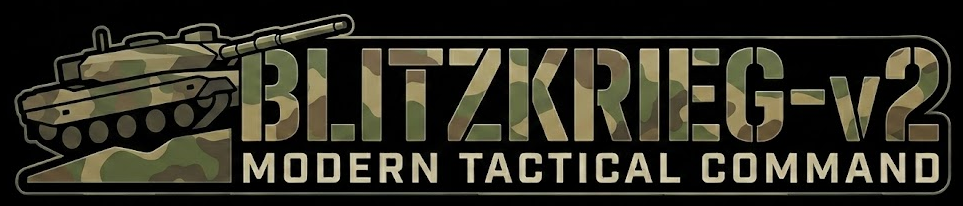
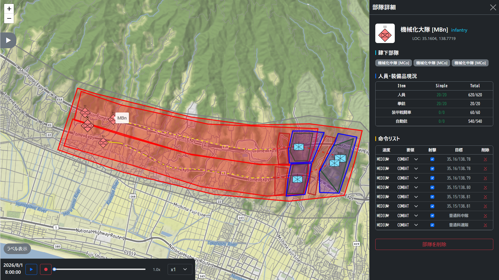

## 概要
戦術レベルの陸上戦闘のシミュレーション

## 構築手順
1. PostGISサーバの構築 (省略すると一応地図情報なしで動く)

下記からDEMとosm.pbfをダウンロードし、それぞれ`geo-server/dem`と`geo-server/osm`以下に配置

ALOSはzipを解凍して、`geo-server/dem/N020E120_N025E125/ALPSMLC30_N020E121_DSM.tif`のようになっていることを期待
- ALOS (https://www.eorc.jaxa.jp/ALOS/jp/index_j.htm)
- OSM (https://download.geofabrik.de/asia.html)

その後、以下を実行
```
cd geo-server
cp .env-sample .env 	# .envを編集
docker compose up -d
chmod +x *.sh
./import_dem.sh 		# 数時間かかる
./import_osm.sh 		# 丸一日かかる
```

2. フロントエンドのビルド (省略可)
```
cd frontend
npm run build
cd ..
```

3. サーバの立ち上げ
```
docker compose up -d
```

## TODO
- [x] Dockerfile
- [x] 編成・諸元ファイル充実
- [x] 機動改善・機動障害図表示機能
- [x] 隷下部隊自動展開機能
- [x] サンプルシナリオ充実
- [ ] 性能改善
- [ ] ネットワーク対戦機能

## ライセンスについて
本ソフトウェアは、以下の2つの形態で提供されます。

### 1. オープンソース（無償）
本ソフトウェアは **GNU Affero General Public License v3.0 (AGPL-3.0)** の下でライセンスされています。
AGPL-3.0の条項に従い、本ソフトウェアを利用・改変してネットワーク経由でサービス提供を行う場合、そのソースコードを公開する義務があります。

### 2. 商用利用（有償・非公開）
商用利用において、ソースコードの公開義務を免除したい場合は、**商用ライセンス**の購入が必要です。
商用ライセンスを購入することで、ソースコードを非公開のまま、自社製品やサービスに組み込んで利用することが可能になります。

* **商用ライセンスに関するお問い合わせ:**
  [こちらのリポジトリのIssue](https://github.com/Kajune/blitzkrieg-v2/issues/new?title=商用ライセンスに関する問い合わせ) からご連絡ください。
  ※Issueのタイトルを「商用ライセンスに関する問い合わせ」として作成していただければ、個別にご対応いたします。
